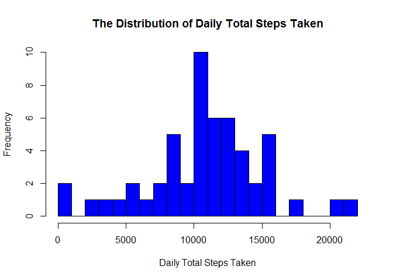
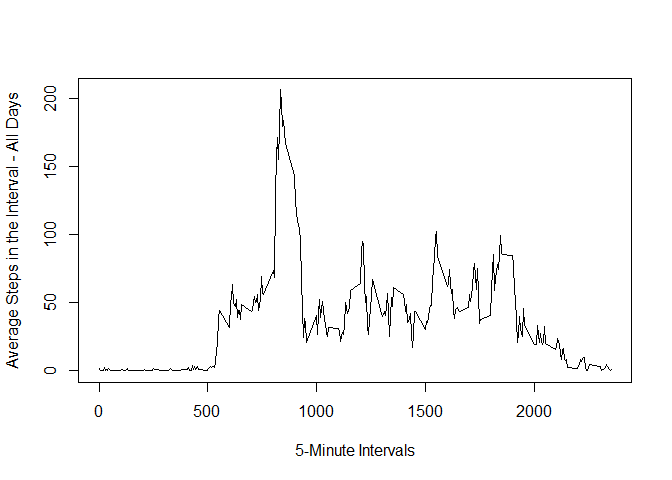
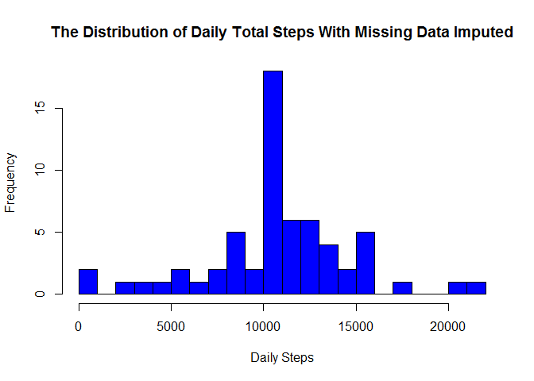

Reproducible Research: Course Project 1
=======================================

Loading and preprocessing the data
----------------------------------

The data in activity.csv is loaded into a data frame by using read.csv

    # Define the classes of the columns in data for faster reading
    cls <- c("integer","character","integer")

    # Read the csv file into a data frame
    df <- read.csv("activity.csv",head=TRUE, colClasses=cls, na.strings="NA")

    head(df)

    ##   steps       date interval
    ## 1    NA 2012-10-01        0
    ## 2    NA 2012-10-01        5
    ## 3    NA 2012-10-01       10
    ## 4    NA 2012-10-01       15
    ## 5    NA 2012-10-01       20
    ## 6    NA 2012-10-01       25

The data is preprocessed for analysis by (1) correcting the type of the
date column, (2) making a new data frame that excludes missing values.

    # Preprocess data: Correct type of date column
    df$date <- as.Date(df$date)

    # Preprocess data: Exclude the NAs
    df_noNA <- subset(df,!is.na(df$steps))

What is mean total number of steps taken per day?
-------------------------------------------------

The total number of steps taken per day is calculated by using tapply to
get the sum.

    # Calculate sum of steps taken per day
    dailyTotal <- tapply(df_noNA$steps, df_noNA$date, sum, na.rm=TRUE, simplify=T)
    head(dailyTotal)

    ## 2012-10-02 2012-10-03 2012-10-04 2012-10-05 2012-10-06 2012-10-07 
    ##        126      11352      12116      13294      15420      11015

A histogram of the total number of steps taken per day is generated.

    # Generate the histogram of the total of daily steps taken
    hist(x=dailyTotal,
         col="blue",
         breaks=20,
         xlab="Daily Total Steps Taken",
         ylab="Frequency",
         main="The Distribution of Daily Total Steps Taken")

<!-- -->

The mean of the daily total is calculated to be 10766.19.

    mean(dailyTotal)

    ## [1] 10766.19

The median of the daily total is calculated to be 10765.

    median(dailyTotal) 

    ## [1] 10765

What is the average daily activity pattern?
-------------------------------------------

A time-series plot is generated to see the average daily activity
pattern using tapply to get the mean number of steps per interval. A
data frame is made for the time-series plot.

    # Calculate the mean number of steps per 5-minute interval
    avgInterval <- tapply(df_noNA$steps, df_noNA$interval, mean, na.rm=TRUE, simplify=T)

    # Make the data frame for the time-series plot
    df_avgInt <- data.frame(interval=as.integer(names(avgInterval)),avg=avgInterval)

    # Generate the time series plot to find the average daily activity pattern
    with(df_avgInt,
          plot(interval,
                avg,
                type="l",
                xlab="5-Minute Intervals",
                ylab="Average Steps in the Interval - All Days"))

<!-- -->

The interval with the maximum number of steps is calculated to be the
835th interval with 206 number of steps.

    # Find the 5-minute interval that contains the maximum number of steps on average per day
    max_steps <- max(df_avgInt$avg)
    df_avgInt[df_avgInt$avg == max_steps, ]

    ##     interval      avg
    ## 835      835 206.1698

Imputing missing values
-----------------------

The total number of missing values in the dataset is calculated to be
2304.

    # Calculate the total number of missing values
    sum(is.na(df$steps))

    ## [1] 2304

The mean for the 5-minute interval is used to substitute for the missing
values. A new data frame is generated with the missing values filled in.

    # Make a new data frame, d_fill, with the missing values replaced by the mean
    df_fill <- df
    k <- is.na(df_fill$steps)
    avgInterval <- tapply(df_noNA$steps, df_noNA$interval, mean, na.rm=TRUE, simplify=T)
    df_fill$steps[k] <- avgInterval[as.character(df_fill$interval[k])]

A histogram with the total number of steps taken each day is generated.

<!-- -->

The mean based on the new dataset is calculated to be 10766.19

    # Calculate the mean of the new filled data
    mean(dailySumFilled)

    ## [1] 10766.19

The median based on the new dataset is calculated to be 10766.19

    # Calculate the median of the new filleddata
    median(dailySumFilled)

    ## [1] 10766.19

There is very little difference between the median with the missing
values taken out (10765) and the one with the missing values filled in
(10766.19). The mean is identical when missing values were taken out
(10766.19) and when missing values were filled in (10766.19). There was
no significant change because we used the mean to fill the missing data.

In the histogram, there was a smoothing out of the graph towards the
center.

Are there differences in activity patterns between weekdays and weekends?
-------------------------------------------------------------------------

A new factor variable was created in the dataset with two levels,
weekday and weekend, indicating whether the date is a weekday or a
weekend.

    # Add a column that identifies whether the date is a weekend or weekday to df_fill
    is_weekday <- function(d) {
         wd <- weekdays(d)
         ifelse (wd == "Saturday" | wd == "Sunday", "weekend", "weekday")
    }

    wndx <- sapply(df_fill$date, is_weekday)
    df_fill$wk <- as.factor(wndx)
    head(df_fill)

    ##       steps       date interval      wk
    ## 1 1.7169811 2012-10-01        0 weekday
    ## 2 0.3396226 2012-10-01        5 weekday
    ## 3 0.1320755 2012-10-01       10 weekday
    ## 4 0.1509434 2012-10-01       15 weekday
    ## 5 0.0754717 2012-10-01       20 weekday
    ## 6 2.0943396 2012-10-01       25 weekday

A panel plot containing 2 time-series plot of the 5-minute interval and
the average number of steps averaged across weekends and weekdays is
generated from the new data set.

    # Generate a time-series plot of weekend and weekday activity
    df_dayOrEnd <- aggregate(steps ~ wk+interval, data=df_fill, FUN=mean)
    library(lattice)
    xyplot(steps ~ interval | factor(wk),
           layout = c(1, 2),
           xlab="Interval",
           ylab="Number of Steps",
           type="l",
           lty=1,
           data=df_dayOrEnd)

<!-- -->

Based on the two activity plots, it seems that activities start earlier
on weekdays than on weekends. Also the number of steps have a greater
peak on weekdays. Weekend activity seems to stay pretty consistent from
the 800th to 1750th interval and are greater than weekday activity from
th 1250th interval to the 1750th interval.
